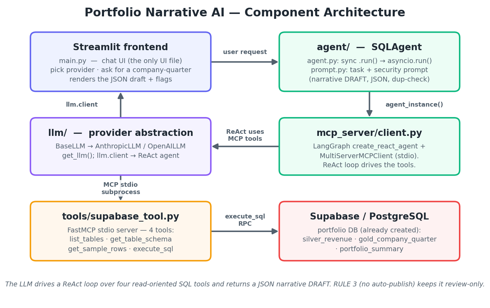
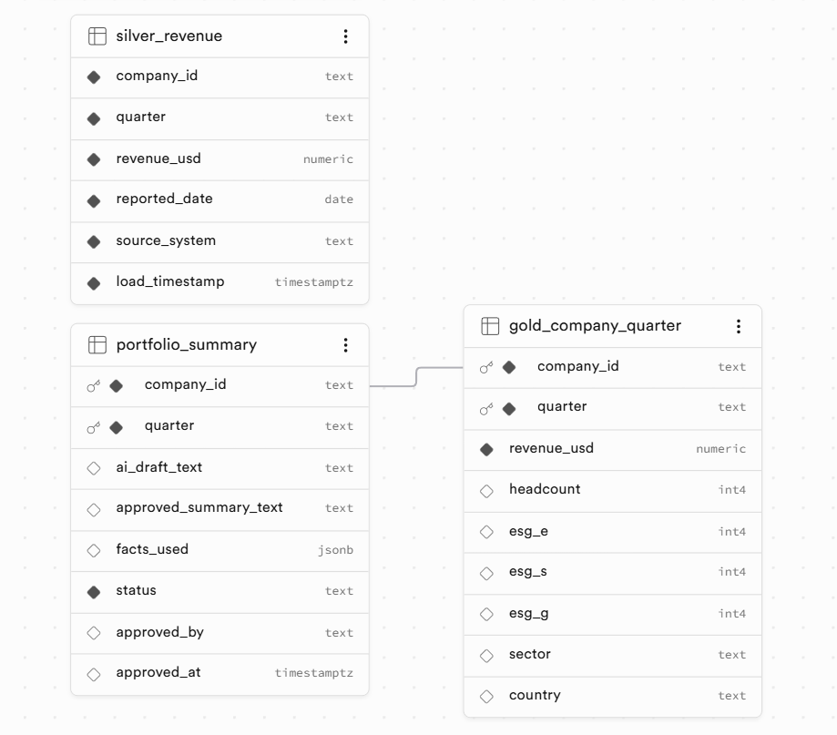
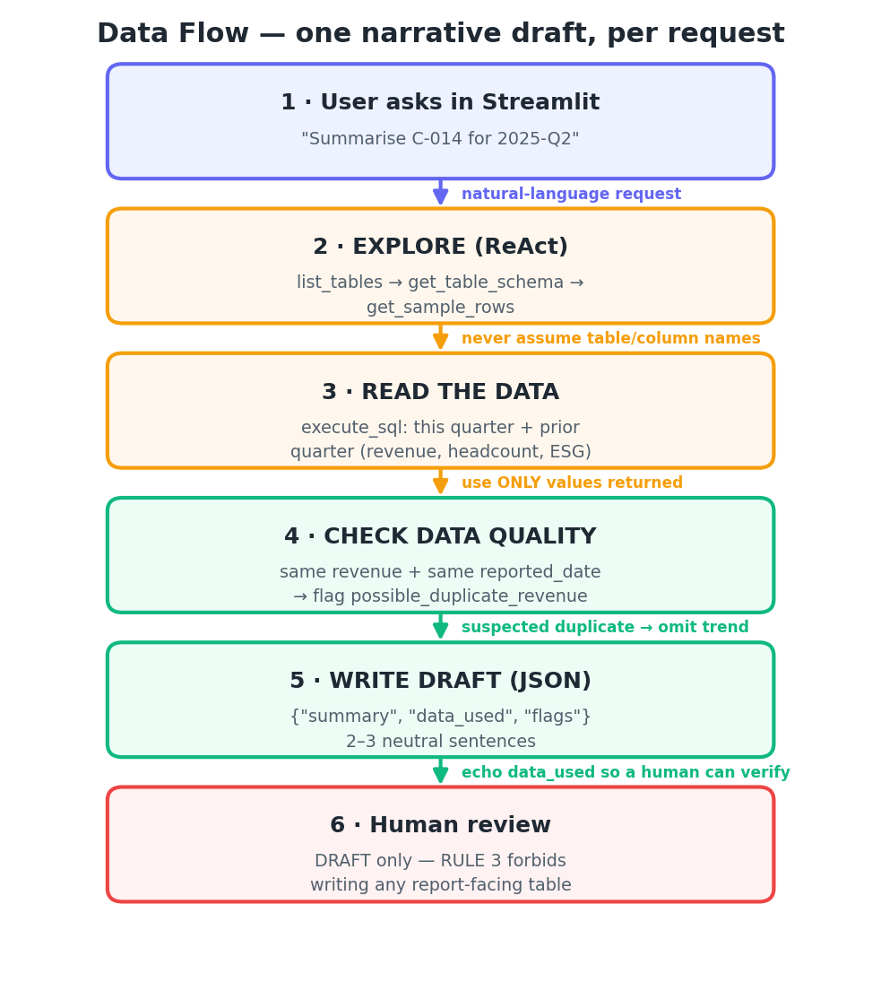

# 📝 Finance Quarterly Report



Finance Quarterly Report is a **Streamlit** app in which a
[LangGraph](https://www.langchain.com/langgraph) ReAct agent (powered by
**Claude** or **GPT-4o**) reads an impact-investment portfolio database in
Supabase and writes short, neutral **narrative summaries** of a company's
quarterly performance — revenue, headcount, and ESG trends.

Every answer is a **draft for human review**: the agent returns structured JSON
(`summary` + `data_used` + `flags`) and is explicitly forbidden from publishing
to any report-facing table.

## ✨ Features

- **Structured data → narrative** — ask for a company-quarter, get a 2–3 sentence
  summary built only from the numbers in the database.
- **Explores before writing** — the agent checks which tables exist, their
  schema, and sample rows before querying (it never assumes table/column names).
- **Data-quality aware** — if a quarter's revenue is identical to the prior
  quarter *and* shares the same `reported_date`, it is flagged as a
  `possible_duplicate_revenue` and the revenue trend is omitted rather than
  reported (a known ingestion hazard in the Silver layer).
- **Draft-only by design** — the prompt's hard rules forbid invented numbers,
  unverified trends, and any write to a final/report-facing table. Output is
  always a reviewable draft.
- **Switchable LLM provider** — Claude (Anthropic) or GPT-4o (OpenAI), from the
  sidebar.
- **MCP tool server included** — the Supabase tools are a standalone FastMCP
  stdio server, reusable by other MCP clients.

## 🖥️ Frontend (Streamlit)

The entire frontend is **Streamlit** (`main.py`) — the only file with UI code:

- a sidebar to pick the LLM provider and see the current model + Supabase
  connection,
- a chat box (pinned to the bottom) to request a summary,
- a chat transcript that renders the agent's response (the JSON draft and the
  SQL/steps it ran),
- "Copy Result", "Save to File", and "Clear Chat" actions.

Run it with `streamlit run main.py` (see [Setup](#️-setup)).

## 🗄️ The database (already created in Supabase)

The screenshot below is the live Supabase project the agent reads:



| Object | Role |
|---|---|
| `silver_revenue` | Raw, append-only ingest — intentionally keeps **stale duplicate rows** (the source of the duplicate-revenue hazard the prompt guards against). |
| `gold_company_quarter` | Curated, **one row per company-quarter** — revenue, headcount, ESG (E/S/G), sector, country. |
| `portfolio_summary` | Draft + approval state for each company-quarter (`ai_draft_text`, `approved_summary_text`, `status`, `approved_by`). The agent only ever produces a draft for it. |

> **Requirement:** the agent's tools call a Postgres RPC function named
> `execute_sql`. If your Supabase project does not have it yet, create it once —
> the SQL is in [`.claude/docs/SETUP.md`](.claude/docs/SETUP.md#database-setup).

## 🏗️ How it works

### Data flow — one narrative draft per request



1. **User asks** in the Streamlit chat (e.g. *"Summarise C-014 for 2025-Q2"*).
2. **`SQLAgent.run()`** wraps the call in `asyncio.run()` to bridge sync → async.
3. **`mcp_server/client.py`** spawns `tools/supabase_tool.py` as a stdio
   subprocess and loads its four tools into a LangGraph ReAct agent.
4. The **ReAct loop** explores (`list_tables` → `get_table_schema` →
   `get_sample_rows`) and reads the company's data — this quarter and the prior
   quarter — with `execute_sql`.
5. The agent applies the **data-quality check** (suspected-duplicate revenue) and
   **writes the draft** as JSON: `{"summary", "data_used", "flags"}`.
6. The result is a **draft for human review** — the prompt forbids writing to any
   report-facing table.

The system prompt lives in `agent/prompt.py` (`task_prompt()` + `security_prompt()`,
combined by `get_full_prompt()`).

For a deeper dive, see [`.claude/docs/ARCHITECTURE.md`](.claude/docs/ARCHITECTURE.md)
and [`.claude/docs/PROJECT_OVERVIEW.md`](.claude/docs/PROJECT_OVERVIEW.md).

## 🧰 Tech stack

| Layer | Technology |
|---|---|
| Frontend | [Streamlit](https://streamlit.io/) |
| Agent | [LangGraph](https://www.langchain.com/langgraph) `create_react_agent` |
| LLMs | Anthropic Claude / OpenAI GPT-4o (via LangChain) |
| Database | [Supabase](https://supabase.com/) (PostgreSQL) |
| Tool protocol | [FastMCP](https://github.com/jlowin/fastmcp) + [langchain-mcp-adapters](https://github.com/langchain-ai/langchain-mcp-adapters) (stdio) |
| Tracing | LangSmith (optional) |

## 📁 Project structure

```
main.py                       # Streamlit frontend (only file with UI code)
agent/                        # SQLAgent + prompts (task_prompt / security_prompt)
llm/                          # provider abstraction (Anthropic / OpenAI)
tools/supabase_tool.py        # FastMCP stdio server — the 4 Supabase tools
mcp_server/client.py          # async MCP client + LangGraph ReAct agent
pic/                          # architecture / data-flow diagrams + Supabase screenshot
.claude/docs/                 # ARCHITECTURE · PROJECT_OVERVIEW · SETUP · DEBUGGING_LOG
```

See [`.claude/docs/PROJECT_OVERVIEW.md`](.claude/docs/PROJECT_OVERVIEW.md) for a
full folder-by-folder breakdown.

## ⚙️ Setup

### Requirements
- Python 3.10
- A Supabase project with the portfolio tables and the `execute_sql` RPC function
  (see [`.claude/docs/SETUP.md`](.claude/docs/SETUP.md#database-setup)).

### Install
```bash
python -m venv .venv
source .venv/bin/activate          # Windows: .venv\Scripts\activate
pip install -r requirements.txt
```

### Environment variables
Create a `.env` (never commit it):

| Variable | Notes |
|---|---|
| `ANTHROPIC_API_KEY` | required for the Claude provider |
| `OPENAI_API_KEY` | required for the GPT-4o provider |
| `SUPABASE_URL` | your Supabase project REST URL |
| `SUPABASE_ANON_KEY` | Supabase anon/public key |
| `LANGSMITH_*` | optional tracing |

Full details in [`.claude/docs/SETUP.md`](.claude/docs/SETUP.md).

### Run
```bash
streamlit run main.py
```

Open the app, pick a provider in the sidebar, and ask for a summary in the chat
box. The MCP tool server (`tools/supabase_tool.py`) is spawned automatically as a
subprocess — no separate terminal needed.

## 💬 Example requests

- "Summarise C-014 for 2025-Q2."
- "Write the quarterly narrative for C-022, 2025-Q1."
- "Compare C-014's Q1 and Q2 2025 and draft a summary."

## 🔒 Governance & security notes

- **Draft-only.** The agent produces a reviewable JSON draft; the prompt's
  `RULE 3` forbids writing to any final/report-facing table, and `RULE 1/2`
  forbid invented numbers and unverified trends.
- **Transparency.** Every response echoes the exact `data_used`, so a human can
  verify the draft against the source rows.
- The `execute_sql` RPC runs with `security definer`; keep your anon key and
  `.env` private. See [`.claude/docs/SETUP.md`](.claude/docs/SETUP.md).

## 📚 More documentation

- [`.claude/CLAUDE.md`](.claude/CLAUDE.md) — project guide index
- [`.claude/docs/PROJECT_OVERVIEW.md`](.claude/docs/PROJECT_OVERVIEW.md) — folder-by-folder breakdown
- [`.claude/docs/ARCHITECTURE.md`](.claude/docs/ARCHITECTURE.md) — data flow, provider abstraction, MCP
- [`.claude/docs/SETUP.md`](.claude/docs/SETUP.md) — env vars, install, database setup
- [`.claude/docs/DEBUGGING_LOG.md`](.claude/docs/DEBUGGING_LOG.md) — history of bugs found/fixed
