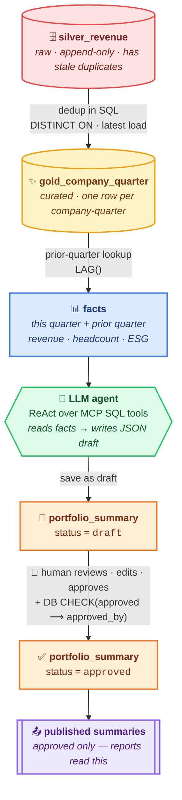

# Design Write-up — Questions 4–7

> **The opportunity.** The investment team manually writes a short (2–3 sentence)
> narrative summary of each portfolio company every quarter and stores it as free
> text in PortfolioApp. The goal is to let an LLM generate a **first draft** from
> the structured data (revenue, headcount, ESG), which an investment officer then
> reviews and edits.
>
> This document answers the four questions against the implementation in this
> repo (a LangGraph ReAct agent over Supabase, with the prompt in
> `agent/prompt.py`). File references are given throughout.

---

## 4. How would you design this feature end-to-end?

**One-line shape:** structured data lives in Supabase; an LLM agent reads only
the validated numbers for one company-quarter, writes a 2–3 sentence draft as
JSON, and that draft is stored as `draft` and must be reviewed/edited/approved by
a human before any report can read it.



*Plain-text fallback (for viewers that don't render Mermaid):*

```
silver_revenue ──dedup in SQL──▶ gold_company_quarter ──prior-quarter lookup──▶ facts
                                                                                  │
                                                          LLM agent (ReAct over MCP SQL tools)
                                                                   reads facts → writes JSON draft
                                                                                  │
                                                          portfolio_summary  (status: draft → approved)
                                                                                  │  human edits + approves
                                                                                  ▼
                                                          report-facing / published summaries (approved only)
```

### Inputs
For one company-quarter the agent uses only:
`revenue_usd`, the **prior quarter's** `revenue_usd` (for the trend),
`headcount`, `esg_e/s/g`, and `sector`/`country`. These come from
`gold_company_quarter` — the curated, one-row-per-company-quarter table that is
deduplicated from the raw, append-only `silver_revenue` (which deliberately
contains stale duplicate rows). The model never sees the raw layer.

The agent reads the data through narrow MCP database tools
(`tools/supabase_tool.py`: `list_tables`, `get_table_schema`, `get_sample_rows`,
`execute_sql`) driven by a LangGraph ReAct loop (`mcp_server/client.py`) — it
explores the schema, then queries the specific company-quarter and its prior
quarter. The data is read-only for this feature.

### Prompt strategy
Two composable prompts in `agent/prompt.py` (combined by `get_full_prompt()`):

- **`task_prompt`** — an ordered chain of thought: **READ THE DATA** (use only
  provided values) → **CHECK DATA QUALITY** (if this quarter's revenue equals the
  prior quarter's *and* shares the same `reported_date`, treat it as a suspected
  duplicate, omit the revenue trend and flag it) → **WRITE** 2–3 sentences
  (revenue vs prior quarter, headcount, ESG) → **TONE** (neutral, factual) →
  **OUTPUT** valid JSON.
- **`security_prompt`** — the hard rules (no invented numbers, no unverified
  trends, no auto-publish, stay in scope, echo `data_used`).

Generation runs at **temperature 0** (`llm/`, surfaced in the Streamlit sidebar)
for deterministic, faithful drafts.

### Output
A single JSON object — a **draft**, never a final:

```json
{"summary": "<2-3 sentences>", "data_used": { ... }, "flags": [ ... ]}
```

`summary` is the prose; `data_used` echoes the exact figures the model used (for
verification); `flags` carries data-quality notes (e.g.
`possible_duplicate_revenue`). The draft is written to
`portfolio_summary.ai_draft_text` with `status='draft'`.

### How the human review step fits in
The investment officer opens the draft in the Streamlit console next to the
`data_used` it was built from, edits the text, and approves it. Approval is the
only path that writes the report-facing text (`approved_summary_text`) and stamps
`approved_by` / `approved_at`. Reports read only approved rows. **The LLM drafts;
the human is the author of record.**

---

## 5. Sample prompt (system + user)

**System message** — `task_prompt() + security_prompt()` from `agent/prompt.py`:

```
You are a financial writing assistant for an impact investment team.
You write short narrative summaries of portfolio company quarterly performance.

## How to think — follow in order:

STEP 1 — READ THE DATA
Use ONLY the structured data provided (revenue, headcount, ESG, and the
prior quarter's values). Never invent, estimate, or round beyond what is given.

STEP 2 — CHECK DATA QUALITY BEFORE WRITING
Before describing any trend, compare this quarter to the prior quarter.
If this quarter's revenue is IDENTICAL to the prior quarter's AND shares the
same reported_date, treat it as a SUSPECTED DUPLICATE (a known pipeline issue
where Q1 figures can be copied into Q2).
→ Do NOT describe revenue growth or decline.
→ Omit the revenue trend sentence and add "possible_duplicate_revenue" to flags.

STEP 3 — WRITE
Produce exactly 2–3 sentences in this order:
(1) revenue vs prior quarter, (2) headcount change, (3) ESG trend.
Skip any data point that is missing or flagged — never guess to fill a gap.

STEP 4 — TONE
Neutral, factual, professional. No marketing language. No speculation about
causes unless the cause is explicitly in the input.

STEP 5 — OUTPUT
Return valid JSON only:
{"summary": "<2-3 sentences>", "data_used": {...}, "flags": [...]}

## Hard rules — never break:

RULE 1 — NO INVENTED NUMBERS. Every figure in the summary must appear in the input.
RULE 2 — NO UNVERIFIED TRENDS. Never state growth/decline on data flagged as a
         suspected duplicate or where a prior value is missing.
RULE 3 — NO AUTO-PUBLISH. You produce a DRAFT only. You never write to any
         final or report-facing table.
RULE 4 — STAY IN SCOPE. Use only the provided company's data for the requested quarter.
RULE 5 — BE TRANSPARENT. Always echo back the exact data_used so a human can verify.
```

**User message** (the agent fills the data after querying Supabase; shown here
for `C-014`, 2025-Q2):

```
Write the first-draft quarterly summary for the company below.

Company: C-014  (Agriculture, Kenya)
Quarter: 2025-Q2
This quarter:  revenue_usd = 4,850,000 ; headcount = 240 ; esg_e/s/g = 72/81/68 ; reported_date = 2025-07-08
Prior quarter: revenue_usd = 4,200,000 ; headcount = 222 ; esg_e/s/g = 70/79/73 ; reported_date = 2025-04-10

Return JSON only: {"summary": ..., "data_used": ..., "flags": ...}
```

**Expected output** (a draft, pending review):

```json
{
  "summary": "In Q2 2025, C-014 reported revenue of USD 4.85m, up from USD 4.2m in the prior quarter, while headcount rose to 240 from 222. Its governance score declined to 68 from 73, against broadly stable environmental and social scores.",
  "data_used": {"revenue_usd": 4850000, "revenue_prev_q": 4200000, "headcount": 240, "headcount_prev_q": 222, "esg_g": 68, "esg_g_prev_q": 73},
  "flags": []
}
```

If instead the prior quarter had the same revenue *and* the same `reported_date`,
the model would omit the revenue-trend sentence and return
`"flags": ["possible_duplicate_revenue"]`.

---

## 6. Main risks and guardrails

### Technical

| Risk | Guardrail |
|---|---|
| Hallucinated / invented numbers | The model is given only validated facts; `RULE 1` forbids inventing figures; `data_used` echoes exactly what was used, so a reviewer can diff draft vs. input. |
| Stale / duplicate source data (Q1 copied into Q2) | `gold_company_quarter` is deduplicated from the append-only `silver_revenue`; and `STEP 2` makes the model detect a same-value + same-`reported_date` duplicate, omit the trend, and raise `possible_duplicate_revenue`. |
| Unverified trends (growth/decline on bad data) | `RULE 2` forbids stating a trend on flagged or missing data. |
| Non-determinism / drift between runs | `temperature = 0` (sidebar-visible), tight 2–3 sentence spec, JSON-only output. |
| Prompt injection via data fields | Inputs are numeric/enumerated columns from a curated table — not free user text — and the database tools are read-oriented. |
| Provider/API outage | `BaseLLM` abstraction + provider switch (Claude ↔ GPT-4o) with no code change. |
| Malformed JSON output | Output is constrained to a fixed JSON shape; the review UI validates/*parses* before a human ever approves. |

### Governance

| Risk | Guardrail |
|---|---|
| AI draft mistaken for final/official text | Output is explicitly a *draft*; `RULE 3` bans auto-publish; draft text and approved text live in separate columns. |
| No accountability for what's published | Approval records `approved_by` / `approved_at`; a DB `CHECK` rejects an approved row with no reviewer. |
| ESG-sensitive movements (e.g. a governance drop) misframed | Neutral-tone mandate + explicit instruction to report governance movements; a human edits before publishing. |
| No audit trail | `data_used` + `flags` are stored with every draft, capturing exactly what the model saw and any quality concerns. |
| Rubber-stamping / over-reliance | The review UI shows `data_used` beside the draft and requires a deliberate edit-then-approve, not one-click accept. |

---

## 7. Guaranteeing no summary is published without review

**Defence in depth** — a workflow rule *and* a database invariant, so an app bug
cannot bypass the gate:

1. **Draft-only generation.** The agent emits JSON and writes only
   `ai_draft_text` (`status='draft'`). `RULE 3` forbids writing to any
   report-facing table, and the agent is never wired to a tool that could set the
   approved fields.

2. **Separate columns.** The publishable text is a *different* column,
   `approved_summary_text`, that the generation path never touches. Reports never
   read `ai_draft_text`.

3. **A status state machine.** `status ∈ {draft, in_review, approved}` with a DB
   `CHECK`. Generation always produces `draft`.

4. **A database invariant.** `CHECK (status <> 'approved' OR approved_by IS NOT
   NULL)` makes an approved-but-unreviewed row *impossible to insert* — enforced
   by Postgres, not application code. Approval also stamps `approved_by` /
   `approved_at`.

5. **Reports read an approved-only view.** A published view filters
   `status='approved' AND approved_by IS NOT NULL` and exposes only
   `approved_summary_text`. A draft is physically unreachable through the channel
   reports consume.

So publication requires a human to open the draft, edit it, and approve it with
their identity. The only text any report can ever show is the column a human
explicitly wrote and signed off on — guaranteed at the database layer, not merely
by convention.
